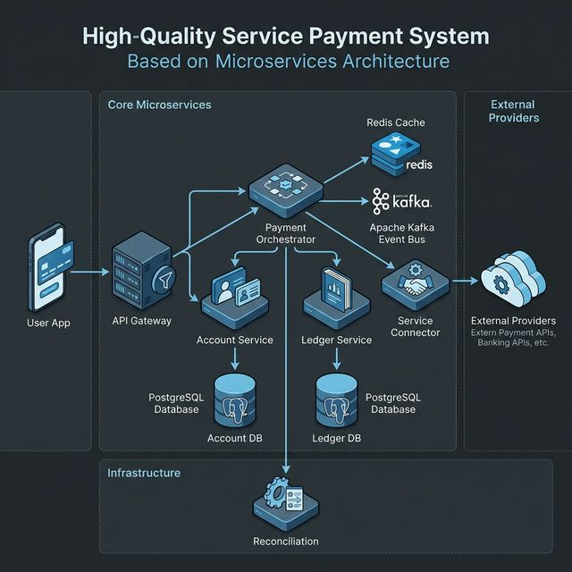
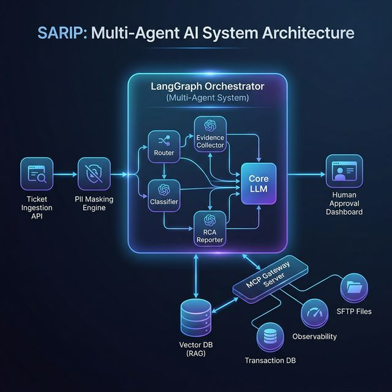

# 🤖 SARIP 
## Sistema Agéntico de Resolución de Incidentes de Pagos

**Una Solución de Próxima Generación para la Operación Bancaria**

---

# 🌍 El Desafío

### El Ecosistema Actual de Pagos
- **Alta Volatilidad:** Integración con más de 300 proveedores de servicios (luz, agua, telefonía, etc.) con APIs diversas (REST, SOAP).
- **Escala Masiva:** Millones de transacciones y conciliaciones diarias.
- **Incidentes Complejos:** Fallos de red, timeouts, y problemas de conciliación (pagos debitados pero no aplicados).
- **Carga Operativa:** Los ingenieros L3 dedican decenas de minutos investigando la causa raíz (RCA) navegando entre bases de datos, logs y herramientas de monitoreo.

---

# 💡 La Solución Integral

Diseñamos una arquitectura híbrida compuesta por **dos pilares fundamentales**:

1. **Service Payment System (Core Transaccional):** 
   Un backend de ultra-baja latencia construido en **Java 17 / Quarkus** para orquestar la ejecución de los pagos.
   
2. **SARIP (Capa de Inteligencia Artificial):** 
   Un sistema Multi-Agente construido en **LangGraph (Python)** diseñado para investigar, deducir y plantear soluciones a los incidentes operativos en tiempo real.

---

# ⚙️ 1. Core Transaccional: Service Payment System

Un orquestador de pagos robusto, asíncrono e integrado:
- **Resiliencia & Idempotencia:** Uso de **Redis** para evitar pagos duplicados ante caídas de red o reintentos del usuario.
- **Integridad Financiera:** Doble partida inmutable (Account Service & Ledger Service) respaldada por **PostgreSQL**.
- **Trazabilidad Absoluta:** Auditoría en **MongoDB** y flujos de eventos asíncronos en **Apache Kafka**.
- **Observabilidad Nivel Enterprise:** Telemetría completa con la pila **ELK (Elasticsearch, Logstash, Kibana)** y métricas de negocio en **Grafana**.

---

# 🗺️ Arquitectura Transaccional

Microservicios desacoplados:
- API Gateway
- Payment Orchestrator
- Account & Ledger DBs
- Service Connector (Hacia los proveedores externos).

---

# 🧠 2. La Revolución: ¿Qué es SARIP?

**SARIP** es nuestro "Orquestador de Cognición" y Enjambre IA. Funciona de manera paralela al sistema principal, operando como un **Ingeniero de Soporte L3 Autónomo**.

- Ingiere los tickets de reclamos complejos desde los canales de soporte (Ej. Jira, ServiceNow).
- Protege la privacidad del usuario enmascarando los datos sensibles (**PII Masking Engine**).
- Realiza **investigación forense profunda** consultando el estado real del sistema y cruzándolo de manera inteligente.

---

# 🤖 El Enjambre L3 (Multi-Agent Swarm)

SARIP orquesta a **un Enjambre de Agentes IA Especializados** trabajando como un equipo (usando modelos como Llama 3.1):

1. **🧑‍⚖️ Supervisor (Lead Investigator):** Recibe el ticket, evalúa, y delega micro-tareas a sus agentes subordinados usando LangGraph.
2. **🗄️ DBA Agent:** Experto en Base de Datos. Genera y ejecuta consultas SQL personalizadas en PostgreSQL para conciliar pagos (Read-Only).
3. **💻 Backend Agent:** Ingeniero Senior Java. Escanea el código fuente (Spring Boot / Quarkus) y revisa el historial de Git para identificar excepciones de negocio.
4. **⚙️ SRE Agent:** Experto en Site Reliability. Ingiere métricas de Prometheus usando consultas PromQL para identificar cuellos de botella de infraestructura.

El Supervisor reúne la evidencia de todos los trabajadores (Workers) y redacta el *Root Cause Analysis* detallado del incidente, entregando un L3 Forensic Report.

---

# 🗺️ Arquitectura del Sistema Agéntico (Swarm)

Un grafo neuronal dirigido (LangGraph Supervisor Mode):
- El Supervisor rutea asíncronamente a los Trabajadores Especializados.
- Conexión segura al backend bancario, BBDD y Prometheus a través de **múltiples Tools dedicados**.

---

# 🛡️ Seguridad y Gobernanza de la Inteligencia Artificial

Implementar IA en el núcleo bancario requiere extremas garantías:

- **Aislamiento de Funciones (Tools):** Los LLMs **nunca** tienen acceso sin restricciones. Cada agente especializado (DBA, Backend, SRE) está aislado y solo puede invocar funciones predefinidas en Python con políticas de Solo-Lectura (Ej. `execute_custom_sql` prohibe estrictamente comandos `INSERT`, `UPDATE` o `DELETE`).
- **Validación Cruzada en el Enjambre:** El Supervisor delega tareas y contrasta los resultados de los múltiples agentes antes de emitir un informe.
- **Human-In-The-Loop (HITL):** SARIP funciona como un copiloto de investigación L3. La aprobación final de una mitigación recae siempre en el ingeniero humano a cargo con base en el *Forensic Report* generado.

---

# 🚀 Conclusión e Impacto Esperado

La integración del orquestador transaccional reactivo (Quarkus) con la potencia cognitiva deductiva de SARIP (LangGraph) generará:

- **⬇️ Reducción drástica del AHT (Average Handling Time):** De 25 minutos de investigación manual a menos de 45 segundos por ticket.
- **🎯 Escalabilidad Operativa:** Capacidad para manejar caídas masivas de empresas de servicios (miles de tickets simultáneos agrupados).
- **💰 Eficiencia de Costos:** Reducción sustancial del costo por resolución de incidente (< $0.15 USD en computo de IA vs. horas hombre).
- **🤝 Elevación de Perfil:** Liberar a los ingenieros de soporte de leer *logs* repetitivos, permitiéndoles enfocar su talento en mejoras estratégicas.

---

# GRACIAS
### ¿Preguntas?
