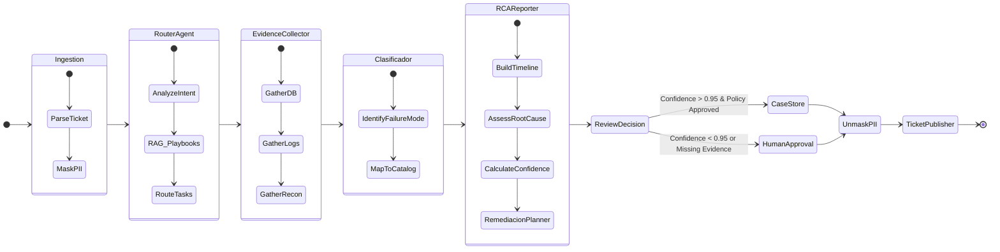

# Diseño de Agentes y Workflow (LangGraph)

El patrón de orquestación central de SARIP utiliza un **Grafo de Estado** (*State Graph*). En este diseño, el "Case File" mutante viaja a través de distintos nodos (agentes o funciones), y cada nodo decide si enriquecer el estado, solicitar más información, o pasar el control a otro nodo.

## 1. El Estado Global (The State)

Todo el grafo orbita alrededor del estado. En Python (usando `langgraph` tipado con Pydantic/TypedDict):

```python
from typing import TypedDict, Annotated, List

class TicketState(TypedDict):
    ticket_id: str
    description: str
    operations: List[str]
    
    # Datos enriquecidos por agentes
    db_context: dict
    trace_context: List[dict]
    reconciliation_context: dict
    
    # Conclusiones
    failure_mode: str
    recommended_action: str
    timeline: List[str]
    confidence_score: float
    
    # Control de flujo
    next_agent: str
    investigation_complete: bool
```

## 2. Nodos (Agentes Especializados)

### A. Router Agente

* **Rol:** Orchestrator inicial y responsable del ruteo inteligente.
* **Responsabilidad:** Leer el ticket entrante, buscar en la Knowledge Base (RAG) casos históricos y playbooks por empresa, extraer los IDs de operaciones a investigar, y decidir a qué colectores de evidencia delegar el caso.
* **Prompt System (Extracto):** *"Eres el Router del sistema de analítica. Tu tarea es leer el reclamo, buscar en la Knowledge Base, y determinar qué evidencia debe ser recolectada. Responde con los comandos de ruteo adecuados."*

### B. Evidence Collector (Recolector de Evidencias)

* **Rol:** Especialista multidominio en extracción de datos (BD, Traces, Logs, Archivos).
* **Responsabilidad:** Ejecutar las herramientas habilitadas por el MCP para componer el puzle de datos. Internamente o mediante sub-grafos consulta:
  1. **DB Pagos & Ledger:** Trae estados transaccionales finales (`INITIATED`, `SETTLED`, `REJECTED`).
  2. **Traces & APM / Logs:** Extrae el *StackTrace* exacto, código HTTP del Gateway, faltas de conectividad, reinicios de Pod.
  3. **Conciliación / SFTP:** Cruza las operaciones de la DB contra los archivos reportados por la Empresa de Servicios (Para casos Batch D+1).
* **Tools:**
  * `get_transaction_lifecycle(op_id)`
  * `query_splunk(trace_id, timeframe)`
  * `get_sftp_reconciliation_diff(company_id, date)`

### C. Clasificador

* **Rol:** Nodo analítico cognitivo.
* **Responsabilidad:** Toma los gigas de datos y ruido crudo obtenidos por el *Evidence Collector* e identifica el Patrón de Falla (`failure_mode`) preciso conforme al catálogo del Banco.

### D. RCA Reporter & Remediación Planner

* **Rol:** Redactor del Root Cause Analysis y Tomador de Decisión.
* **Responsabilidad:** Genera el Timeline cronológico estricto, justifica sus hallazgos, redacta la explicación amigable y recomienda la acción a tomar (Reversar, Reintentar, Escalar). Determina el Nivel de Confianza final del Caso.
* **Regla Crítica:** Si no tiene evidencias concluyentes (i.e. Traces vacíos y DB en estado ambiguo), decrece el nivel de confianza forzando el paso por `Human Approval`.

## 3. Diagrama de Flujo del Grafo



## 4. Estrategia de Ruteo Inteligente

LangGraph permite ruteo dinámico (*conditional edges*). Si el **Evidence Collector** interactuando con Splunk falla en encontrar un TraceId originario, puede enviarse de vuelta a sí mismo recargando un tool distinto: *"No encontré logs con el TraceID X. Volveré a consultar la DB de pagos por la `Fecha/Hora` exacta para buscar en Splunk usando una ventana de tiempo estricta."*

Este ciclo iterativo de descubrimiento imita perfectamente el proceso mental de un humano investigando un incidente.
