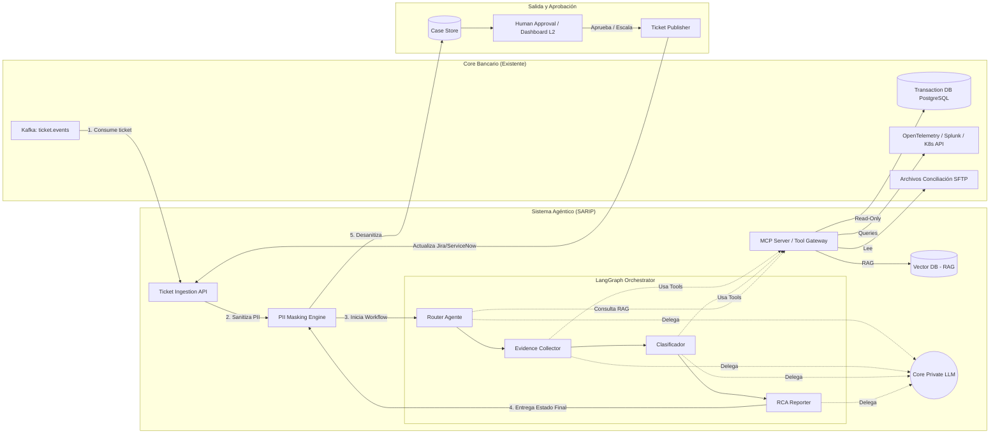
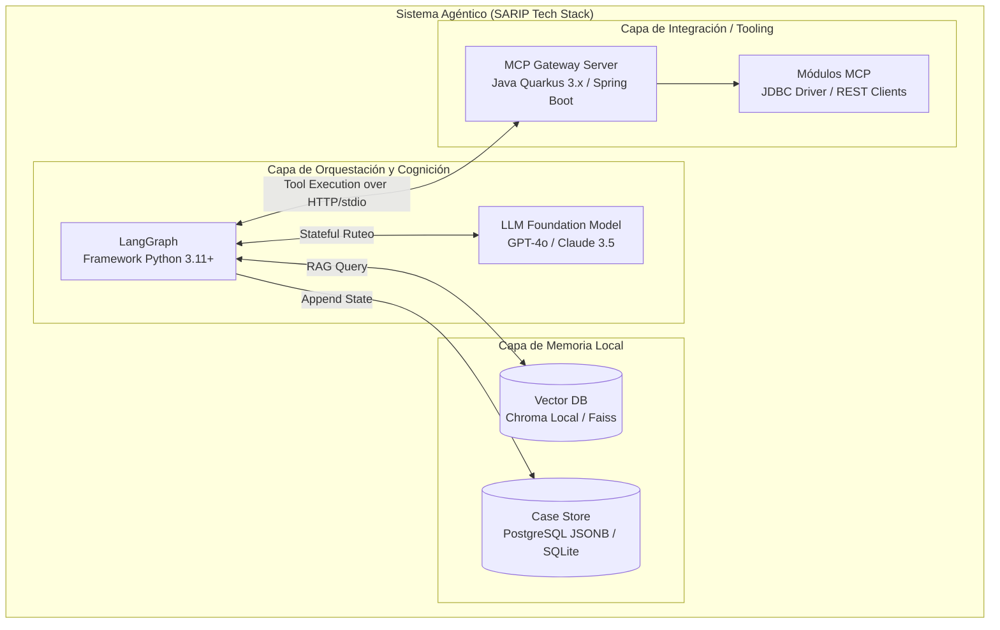

# Sistema Agéntico de Resolución de Incidentes de Pagos (SARIP)

> **Índice de Documentación de Arquitectura:**
>
> * Plan Principal y Stack Técnico: Este documento (`planning.md`)
> * Diseño de LangGraph y Agentes: [`agent_workflow.md`](./agent_workflow.md)
> * Schema JSON del Case File y PII: [`case_schema.md`](./case_schema.md)
> * Arquitectura del Servidor MCP: [`mcp_gateway.md`](./mcp_gateway.md)

---

## 1. Plan de Implementación por Fases

### Fase 1: MVP - Asistencia en Triage y "Shadow Mode" (Meses 1-3)

* **Alcance:** Agentes en modo **100% Read-Only**. Integración inicial con herramientas de observabilidad y réplicas de lectura de base de datos.
* **Operación:** El sistema opera asíncronamente junto al panel de soporte actual. Cuando entra un ticket, el agente investiga y añade una "Pestaña de IA" en el caso con Timeline, Evidencias y Root Cause sugerido. Un humano de Nivel 2 (L2) valida y toma la decisión final.
* **Objetivo:** Recopilar feedback humano, calibrar prompts y alimentar la base de conocimientos con las correcciones manuales para el Golden Dataset.

### Fase 2: V2 - Resolución Semiautomatizada y Agrupación (Meses 4-6)

* **Alcance:** Integración con Vector DB para RAG (Playbooks históricos). Detección de incidentes en lote (masivos).
* **Operación:** El orquestador correlaciona tickets que entran en la misma ventana de tiempo y comparten `failure_mode` (ej. caída general de Empresa XYZ). Genera un "Incidente Padre" y agrupa los reclamos individuales.
* **Objetivo:** Reducir drásticamente la carga sobre los analistas en caídas de empresas de servicios o fallos de red (Timeouts / HTTP 5xx concurrentes).

### Fase 3: V3 - "Close-Loop" y Ejecución Controlada (Meses 7-9)

* **Alcance:** Introducción de acciones de escritura/remediación bajo el principio de los "4-ojos" (Four-Eyes Principle) o reglas deterministas automáticas (Policies).
* **Operación:** El agente puede proponer comandos (`Reversar Débito`, `Reintentar Pago`, `Notificar Conciliación`). Si el *Confidence Score* es > 0.95 y el caso cae bajo políticas pre-aprobadas, se auto-ejecuta. Si no, va al buzón de 'One-Click Approve' del supervisor humano.

---

## 2. Arquitectura Técnica Detallada

El sistema adopta un patrón de **Orquestación de Grafo de Estado (LangGraph)** desacoplado del Sistema Transaccional Core.



**Propuesta de Agentes Especializados (Orquestación LangGraph):**

1. **Router Agente (Triage):** Su foco es clasificar el ticket entrante, deducir la Empresa de Servicios (ej. Telefónica, Claro) y sacar copias de los Playbooks (RAG). Delega el trabajo a los colectores correspondientes.
2. **Evidence Collector (Extractor):** Un agente técnico multiskill. Se comunica con el **MCP Server** para:
    * Hacer *queries* a la base de datos de pagos (obtener estados finales).
    * Consultar la API de Splunk / ElasticSearch para sacar logs.
    * Consultar archivos de conciliación.
3. **Clasificador:** Identifica anomalías a partir del `evidence` retornado. Su trabajo base es mapear una ensalada de logs hacia uno de los fallos canónicos del banco (ej. `TIMEOUT_INFRA`, `TIMEOUT_BUSINESS`, `NSF`).
4. **RCA Reporter & Remediación Planner:** Concluye el expediente. Escribe la historia clínica "paso a paso" de lo que falló. Dicta nivel de confianza (Score) y define si se va por acción en "Close-Loop" o escalamiento (Human Approval).

---

## 3. Tech Stack Diagram (Componentes Físicos)



---

## 4. Propuesta de Foundation Models (LLMs)

El sistema agéntico SARIP depende críticamente de la capacidad de **Tool Use (Function Calling)**, la ventana de contexto para ingerir logs, y la habilidad de razonamiento paso a paso. Se proponen modelos diferentes según la capa de inteligencia, optimizando TCO (Costo Total de Propiedad) y latencia:

### A. Para el "Evidence Collector" y "Router" (Modelos Ágiles de Tools)

Estos agentes necesitan extremada velocidad, bajísima latencia y precisión casi robótica para invocar parámetros JSON hacia el MCP Server. No se requiere gran profundidad retórica ni razonamiento complejo.

* **Opción 1: Anthropic Claude 3.5 Haiku.**
  * *Por qué:* Es posiblemente el modelo más rápido del mercado manteniendo un rendimiento Tier-1 en estructuración de JSON. Permite ingestión altísima de tokens de contexto (>200K) lo cual es útil si recibe un log completo de Splunk y solo debe extraer un bloque específico en milisegundos.
* **Opción 2: OpenAI GPT-4o-mini.**
  * *Por qué:* Costo/Beneficio inigualable. Extremadamente confiable para seguir firmas de funciones (Tool Use) gracias al *Structured Outputs* nativo de la API de OpenAI.

### B. Para el "Clasificador" y el "RCA Reporter / Juez" (Modelos Heavy-Reasoning)

Estos agentes consolidan toda la investigación. Necesitan comprender profundamente el contexto de negocio, deducir lógicamente que una falta de fondos (NSF) es la causa raíz aunque los logs también arrojen un timeout colateral. Su salida impacta la política de aprobación humana.

* **Opción 1: Anthropic Claude 3.5 Sonnet (Opción Recomendada).**
  * *Por qué:* Considerado el estándar de la industria en **Agentic Cognition** y entendimiento de código/sistemas complejos. Su manejo de ambigüedad técnica y reducción de alucinaciones en tareas forenses (leer stacktraces cruzados con estados transaccionales) supera hoy en día a la familia GPT-4.
* **Opción 2: OpenAI GPT-4o.**
  * *Por qué:* Sólido en razonamiento lógico deductivo. Su ventaja frente a Claude radica si el banco ya tiene un Enterprise Agreement fuerte con Microsoft Azure, facilitando la adopción por compliance interno (*Azure OpenAI Service*).

### C. Para la Base de Conocimiento RAG (Embedding Models)

Puesto que se indexarán "Playbooks" y "Topologías de Red" que a veces contienen código o palabras técnicas propietarias:

* **Modelo:** text-embedding-3-small (OpenAI) o cohere.embed-v3 (Cohere).
  * *Por qué:* Alta compresión semántica a bajo costo (dimensión reducida). Cohere sobresale en búsquedas híbridas (semántica + keyword exacta, crucial para cuando se busca un `error_code` técnico exacto).

### D. Enfoque de Modelos Locales / Open Source (Si hay restricción de Nube)

Si la política del Banco es **"Zero Cloud"** (incluso para APIs enterprise), el stack puede montarse On-Premise (requerirá hardware NVIDIA A100 o H100):

* **Router / Collector:** Llama 3.1 8B (vía Ollama/vLLM) ajustado para Function Calling (o Mistral Nemo).
* **RCA Reporter / Juez:** Llama 3.1 70B Instruct. Capaz de realizar razonamiento profundo casi al nivel del GPT-4 inicial si el prompt System está altamente restringido.

---

## 3. Diseño del Case File (Schema Estructurado)

El estado del sistema (State) que recorre todo el grafo LangGraph es un JSON determinista que los agentes van enriqueciendo:

```json
{
  "ticket": {
    "ticket_id": "TCK-84930",
    "reported_issue": "Débito realizado pero servicio no pagado",
    "operations_to_investigate": ["OP-9923-11A", "OP-9923-11B"]
  },
  "investigation": {
    "db_ledger_status": {}, 
    "telemetry_traces": [], 
    "reconciliation_diffs": [],
    "audit_trail": [
      {"agent": "DB_Investigator", "action": "query_ledger", "timestamp": "..."}
    ]
  },
  "synthesis": {
    "failure_mode": "TIMEOUT_WITH_DEBIT_APPLIED",
    "owner": "COMPANY_API_GATEWAY",
    "severity": "HIGH",
    "timeline": [
      "10:02:11 - Débito en CBS exitoso (Auth id: 119)",
      "10:02:12 - Request enviado a Empresa Agua Corp",
      "10:02:22 - Timeout (HTTP 504) recibido de la empresa"
    ],
    "root_cause": "Caída del enlace VPN / API Gateway del facturador. No hubo reintento asíncrono configurado.",
    "evidences": ["TraceID: a1b2c3d4", "LogLine: ConnectionReadTimeoutException en AguaCorpClient"],
    "recommended_action": "REJECT_AND_REVERSE_DEBIT",
    "confidence_score": 0.98,
    "requires_human_approval": false
  }
}
```

---

## 4. Diseño del Knowledge Base (RAG)

El Vector DB se estructurará con particiones lógicas por tipo de conocimiento operativo:

1. **SOPs y Playbooks (`collection_playbooks`):**
    * Documentos Markdown extraídos del portal corporativo del banco. Ej: `"Playbook: Manejo de HTTP 429 de Telefónica"`, `"Playbook: Arreglo de conciliaciones truncadas End-of-Day"`.
    * *Metadata*: `service_company_id`, `error_type`.
2. **Histórico Resolutivo (`collection_resolved_cases`):**
    * Tickets resueltos con Alta Confianza (`confidence > 0.95`). Usados para Few-Shot Prompting, enseñando al agente cómo deducir en base al pasado.
3. **Arquitectura y Mapeo de Infra (`collection_topology`):**
    * Mapeo de microservicios, IPs, Tópicos de Kafka, namespaces en AKS. Retribuible cuando el agente necesita saber "En qué namespace busca el servicio de Telefonía".

---

## 5. Diseño de Agentes y Workflow (LangGraph)

**Workflow (Ciclo de Vida del Ticket):**

1. **Supervisor / Triage Agent:** Analiza la descripción inicial, busca en el RAG el contexto de la empresa de servicios, y delega a recolectores de datos en paralelo.
2. **Data Investigator Agent:** Consulta al MCP base de datos transaccional, ledger de cuentas y Kafka de eventos emitidos.
3. **Observability Agent:** Toma el ID de la transacción y va por los logs exactos, correlaciona Trace IDs y extrae excepciones de código reales y códigos de red GRP/HTTP.
4. **Reconciliation Agent:** (Si aplica) Se invoca si se reportan "Inconsistencias D+1". Lee el archivo batch SFTP de la empresa y la base Postgres del banco haciendo cruces.
5. **Synthesizer Agent (El "Juez"):** Consolida todo. Extrae el Timeline, evalúa el `failure_mode`, aplica la lógica estricta de mitigación del playbook, escupe el "Case File" final y el Score de Confianza.

---

## 6. Diseño del Tool Gateway / MCP Server

El servicio encargado de blindar la infraestructura será un contenedor que expone herramientas formato *Model Context Protocol*, garantizando que al LLM sólo lleguen firmas precisas y controladas:

* **`Tool: get_transaction_lifecycle(op_id)`:** Ejecuta de fondo una macro-query SQL (Read-Only) tuneada por DBAs para traer el estado consolidado de tabla clientes, caja y pagos.
* **`Tool: get_trace_by_id(trace_id)`:** Llama al API de OpenTelemetry/Jaeger.
* **`Tool: get_pod_events(microservice_name, timeframe)`:** Busca OOMKills/CrashLoopBackOffs en Kubernetes para justificar pérdida de estados en tránsito.
* **`Tool: query_playbook(query, company_id)`:** Tool de búsqueda semántica RAG oculta tras el MCP.

---

## 7. Estrategia de Seguridad (Enterprise Grade)

1. **Red e Infra:** El MCP Server es el *único* componente con acceso a datos. El LLM interactúa desde una subred aislada (VNet in Azure / PrivateLink VPC) sin salida genérica a internet.
2. **Principio de Privilegio Mínimo (Read-Only):** En Fase 1 y 2, las credenciales del MCP Gateway son de solo lectura mediante roles restrictivos e IAM limitando acceso a vistas (Views) específicas desprovistas de información personal irrelevante.
3. **PII y Tokenización:** El texto del ticket y de los logs pasa por un sanitizador asíncrono. Un string como `"La cuenta 123456789 del Sr. Juan Perez..."` llega al LLM como `"La cuenta [ACCOUNT_NUM] del Sr. [PERSON_NAME]..."`. El mapa de tokens se guarda en caché y se revierte al mostrar el resultado final al dashboard L2.
4. **Autorización de Acciones (HITL):** Cualquier `Intent` de escritura en V3 requerirá la provisión de un "JWT Token" de autorización de origen humano anidado en el context call del MCP.

---

## 8. Estrategia de Testing (Validación y Resiliencia)

1. **Unit & Mock Testing:** El MCP Server es de código tradicional (Java). Se prueba con JUnit + Mockito al 100% de cobertura de código asegurando que no permita Inyecciones SQL (ej. truncates en el `op_id`).
2. **Integration (E2E) determinista:** Ejecución del Grafo sin invocar LLMs (usando respuestas mockeadas de un agente Dummy) para validar que el ruteo de estados de LangGraph funciona sin deadlocks.
3. **Golden Dataset & LLM Eval (Métrica Clave):** Suite de validación sobre LangSmith o MLflow. Se corre el pipeline asíncrono contra un archivo CSV con 5,000 incidentes pasados conocidos. Se miden % Precisión de Identificación del `failure_mode` y la Fidelidad del `timeline`.
4. **Chaos Engineering & Limit Testing:**
    * Simular logs monstruosos (10MB de stacktrace continuo) para verificar cortes automáticos por límite de Context Window del LLM.
    * Simular latencias en OpenTelemetry (agente debe saber cuándo responder "No pude obtener traces por Timeout_Infra" y no colgar el thread).

---

## 9. Métricas de Éxito (KPIs)

**KPIs de Negocio:**

* **AHT (Average Handling Time):** Reducción esperada del 60% (ej. de 25 min a 10 min por ticket en Fase 1, a minutos en Fase 2).
* **FCR (First Contact Resolution):** Aumento del % de casos explicados certeramente desde el primer contacto del L2.
* **Resolution Rate:** % de falsos positivos en "debited but not applied" prevenidos automáticamente.

**KPIs Técnicos:**

* **Agent Latency:** Tiempo end-to-end de generación del Case File (Target < 45 segundos).
* **Tool Error Rate:** % de veces que una tool invocada por el LLM falla por mal parseo de sintaxis (Hallucination Alert).
* **Token / Compute Cost Unitary:** Estricto monitoreo del costo cloud para que resolver un caso con IA cuente como < $0.05 a $0.15 USD.

---

## 10. Estimación de Riesgos Técnicos y Mitigaciones

| Riesgo | Probabilidad / Impacto | Estrategia de Mitigación |
| :--- | :--- | :--- |
| **Alucinación Analítica** (El LLM inventa un timeout que no existe). | Media / Crítico | Exigencia por System Prompt de adjuntar la evidencia (`TraceID` exacto) para cada afirmación. Synthesizer Agent ejecuta verificación cruzada antes del JSON final. |
| **Context Window Overflow** (Logs de transacciones excesivamente largos). | Alta / Alto | Componentes en el MCP filtrarán ruidos y devolverán solo líneas con severidad ERROR u omitirán logs de librerías bases. |
| **Cuellos de botella de Rate Limits** (Demasiados tickets concurrentes contra la API del modelo). | Alta / Medio | Implementar Kafka para inyectar tickets asíncronamente con un Pool de Consumidores limitados. Agente trabaja con Throttling preventivo. |
| **Data Drift en Playbooks** (Playbooks RAG desactualizados sugieren acciones obsoletas). | Media / Alto | Integrar metadata semántica en los playbooks con fecha de "Validez". Forzar re-indexación y human-review del Knowledge Base cada trimestre. |

---

## 11. Roadmap de Implementación Local (Sprints de 2 Semanas)

Dado que el entorno es local (POC en la PC del desarrollador) y no orientado a producción inmediata, el roadmap se estructurará en dos semanas de trabajo intensivo para desarrollar un MVP funcional y maduro "End-to-End".

### Semana 1: Cimientos y Herramientas (Tooling & State)

#### Día 1: Setup y Boilerplate Arquitectónico

* Inicialización del entorno Python (para LangGraph) y de Java/Quarkus (para el MCP Server).
* Definición de dependencias e interfaces (Mock de PostgreSQL local, API keys para los LLMs en `.env`).
* Creación de la estructura base de directorios en ambos repositorios.

#### Día 2-3: Desarrollo del MCP Server (Solo-Lectura)

* Implementación del Tool Gateway en Java (Quarkus).
* Creación de tablas Mock en H2 o PostgreSQL local para simular la Base de Datos Core.
* Exposición de herramientas clave (`get_transaction_lifecycle`, `query_logs` simulando llamadas a Splunk).

#### Día 4: Diseño del Estado (State) y RAG Básico

* Tipado estricto e instanciación del `TicketState` (Case File JSON) en Python usando Pydantic.
* Configuración de un indexador en memoria local (ChromaDB o Faiss) para albergar 3 playbooks de resolución base en formato Markdown.

#### Día 5: Router Agente (Triage Inicial)

* Implementación del primer agente: **Router Agente** en LangGraph.
* Definición del system prompt para la lectura del ticket inicial, recuperación del RAG y extracción de IDs de operaciones financieras.

### Semana 2: Inteligencia y Orquestación de Grafo

#### Día 6-7: Evidence Collector (El Tractor de Datos)

* Construcción del **Evidence Collector**, orquestándolo para que consuma eficientemente el MCP Server local.
* Lógica de ruteo interno: Que el agente sepa si necesita ir primero a la DB y luego a la herramienta de logs en base a lo que va encontrando en `TicketState`.

#### Día 8-9: Clasificador (Cognición Forense)

* Implementación del nodo analítico cognitivo.
* Diseño rápido de prompts (Prompt Engineering) para que Claude/GPT-4o puedan ingestar el ruido provisto por el recolector de evidencias, entender el error y mapearlo contra el catálogo del banco.

#### Día 10: RCA Reporter y Juez Final

* Implementación del **RCA Reporter & Remediación Planner**.
* Generación del Timeline de resolución y lógica de umbral de riesgo: cálculo del Nivel de Confianza (Confidence Score).
* Redacción del dictamen final para adjuntarlo al "Case Store".

#### Día 11: Ensamblado del Grafo y PII Masking Base

* Conexión de todos los nodos (`Router` -> `Collector` -> `Clasificador` -> `Reporter`) mediante los Edges de LangGraph.
* Incorporación de una función rápida en el nodo Ingreso para el ofuscamiento de los números de cuenta reportados en el ticket original.

#### Días 12-14: Pruebas E2E y Casos Extremos (Golden Dataset Testing)

* Correr el script conectando el Grafo asíncrono LangGraph + servidor Quarkus vivo (MCP).
* Validar 3 casos de uso específicos completos: "Timeout de la Empresa", "Inconsistencia de Conciliación", "Problema de Red de Infraestructura".
* Imprimir y revisar el `Case File` final consolidado en consola para dar por validado el esquema agéntico local, refinando prompts finales si hay alucinaciones.
